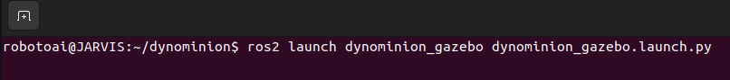
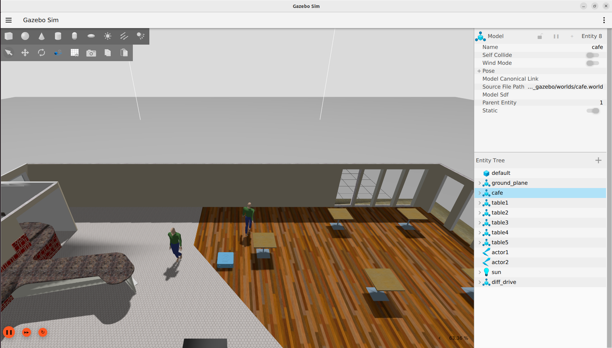

# dynominion_gazebo

## Overview

The dynominion_gazebo package integrates Gazebo sensor plugins along with the gazebo_ros2_control plugin to create a complete simulation environment for the Dynominion robot.

It is responsible for generating the Gazebo world, spawning the Dynominion URDF model, and establishing seamless communication between Gazebo and ROS 2.

This package enables real-time interaction, control, and visualization of the robot within a simulated environment, combining physical simulation, ROS 2 interfaces, and customizable worlds and models for testing and development.

All 3D models used in the simulation are stored in the models/ folder, while the Gazebo world definitions are located in the worlds/ folder.

This package includes two launch files: - dyniminion_gazebo.launch.py: Spawns the Dynominion robot in the Gazebo world and establishes communication between Gazebo and ROS 2. - rviz_model_view.launch.py: Visualizes the Dynominion robot in RViz2 using a fixed reference frame.


---

## Launch Gazebo Simulation

```bash
ros2 launch dynominion_gazebo dynominion_gazebo.launch.py
```





---

## Launch RViz Visualization

```bash
ros2 launch dynominion_gazebo rviz_model_view.launch.py
```


---

## Package Structure

```
dynominion_gazebo
├── CMakeLists.txt
├── config/
│   ├── diff_drive_controller.yaml
│   └── gz_bridge.yaml
├── dynominion_gazebo/
│   ├── __init__.py
│   ├── joint_state_republisher.py
│   └── odom_modifier.py
├── launch/
│   ├── dynominion_gazebo.launch.py
│   └── rviz_model_view.launch.py
├── models/
│   ├── Cafe/
│   ├── Cafe_table/
│   ├── actor/
│   └── male_visitor/
├── package.xml
├── rviz/
│   └── view_robot.rviz
├── urdf/
│   ├── dynominion.urdf.xacro
│   ├── gazebo_ros2_control.xacro
│   └── gazebo_sensor_plugin.xacro
└── worlds/
    └── cafe.world
```
## Package Requirements

    - gazebo_ros
    - gazebo_ros2_control
    - ros2_control
    - controller_manager
    - xacro
    - urdf
    - robot_state_publisher
