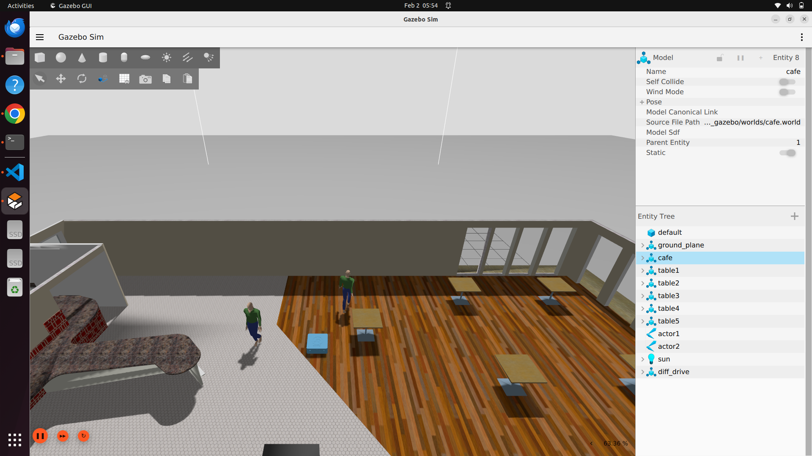
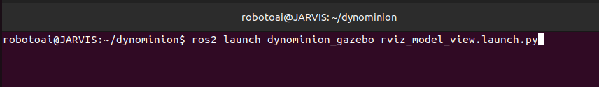

# 🎮 dynominion_gazebo

## 📋 Overview

The **dynominion_gazebo** package integrates Gazebo sensor plugins along with the `gazebo_ros2_control` plugin to create a complete simulation environment for the Dynominion robot.

This package is responsible for:
- 🌍 Generating the Gazebo simulation world
- 🤖 Spawning the Dynominion URDF model
- 🔗 Establishing seamless communication between Gazebo and ROS 2
- 🎛️ Providing differential drive control via ros2_control

---

## 🚀 Launch Gazebo Simulation

```bash
ros2 launch dynominion_gazebo dynominion_gazebo.launch.py
```




---

## 🎨 Launch RViz Visualization

```bash
ros2 launch dynominion_gazebo rviz_model_view.launch.py
```




---

## 📁 Package Structure

```
dynominion_gazebo
├── CMakeLists.txt
├── config/
│   ├── diff_drive_controller.yaml
│   └── gz_bridge.yaml
├── dynominion_gazebo/
│   ├── __init__.py
│   ├── joint_state_republisher.py
│   └── odom_modifier.py
├── launch/
│   ├── dynominion_gazebo.launch.py
│   └── rviz_model_view.launch.py
├── models/
│   ├── Cafe/
│   ├── Cafe_table/
│   ├── actor/
│   └── male_visitor/
├── package.xml
├── rviz/
│   └── view_robot.rviz
├── urdf/
│   ├── dynominion.urdf.xacro
│   ├── gazebo_ros2_control.xacro
│   └── gazebo_sensor_plugin.xacro
└── worlds/
    └── cafe.world
```
### Package Requirements

    - gazebo_ros
    - gazebo_ros2_control
    - ros2_control
    - controller_manager
    - xacro
    - urdf
    - robot_state_publisher
