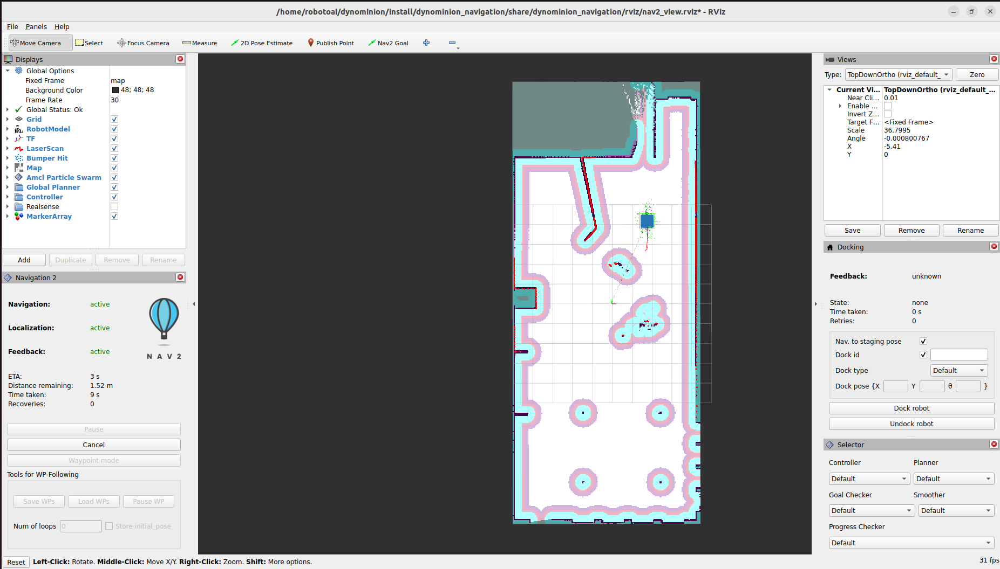

#   dynominion_navigation

## Overview

This package provides the main navigation stack for the Dynominion robot. It integrates ROS 2 Navigation (Nav2) components, enabling autonomous movement, path planning.

This package launches the Nav2 stack for Dynominion using the dynominion_nav_bringup.launch.py file. By default, it creates a ROS 2 container and loads all required navigation plugins within it.

The navigation parameters and configuration files are stored in the **config/** folder.

All parameters used in the configuration are based on the default Nav2 examples, except for the customized footprint and collision settings, which are tailored for the Dynominion robot’s geometry.

## Package Structure
```
dynominion_navigation       
├── CMakeLists.txt      
├── config      
│   └── nav_param.yaml      
├── launch      
│   ├── dynominion_nav_bringup.launch.py        
│   └── navigation_launch.py    
├── package.xml     
├── README.md       
└── rviz        
    └── nav2_view.rviz  
```
## Package Requirements

    - nav2_bringup
    - Navigation2 packages
    - tf2_ros
    - geometry_msgs, sensor_msgs

## Launch

After launching gazebo, run the following command to start the navigation system:
    
```bash
ros2 launch dynominion_navigation dynominion_nav_bringup.launch.py
```
.png)
---

## 2D Pose Estimate

1. Open RViz after launching navigation.
2. Click **2D Pose Estimate**.
3. Set robot's initial position on the map.


---

## Goal Navigation

1. Click **Nav2 Goal** in RViz.
2. Select destination location.
3. Robot will autonomously navigate to the goal.



---

## Navigation Demo


