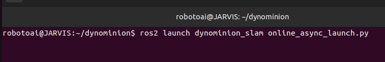
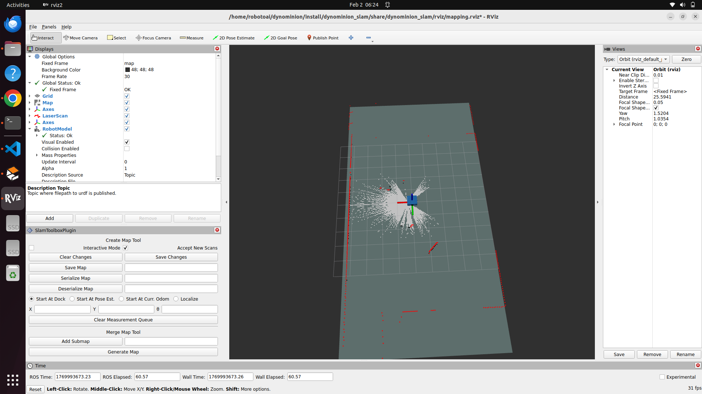

#   dynominion_slam

### Overview

The dynominion_slam package enables SLAM Toolbox–based mapping for the Dynominion robot. It provides both online and offline mapping capabilities to support flexible and efficient map generation.

This package integrates SLAM Toolbox with the Dynominion robot to perform simultaneous localization and mapping. 

It includes multiple launch configurations for different mapping modes and uses parameter files stored in the **config/** folder for customization.

The launch folder includes three main launch files:     
* online_async_launch.py – Performs live mapping asynchronously. The map is updated after loop closures or periodic optimizations.
* online_sync_launch.py – Performs live mapping synchronously, updating the map with each incoming sensor measurement.
* offline_launch.py – Used for offline mapping with previously recorded data stored as ROS bags.


## 📁 Package Structure

```
dynominion_slam
├──  CMakeLists.txt   
├──  config/
│   ├──  laser_filter.yaml
│   ├──  mapper_params_offline.yaml
│   ├──  mapper_params_online_async.yaml
│   └──  mapper_params_online_sync.yaml
├──  launch/
│   ├──  offline_launch.py
│   ├──  online_async_launch.py
│   └──  online_sync_launch.py
├──  package.xml
└── rviz/
     └── mapping.rviz


---

##  Requirements

| Package | Purpose |
|---------|---------|
| `slam_toolbox` | Core SLAM functionality |
| `laser_filters` | Laser scan filtering |
| `rosbag2` | Required for offline mapping |

```bash
sudo apt install ros-humble-slam-toolbox ros-humble-laser-filters
```

---

## � Online Sync Mapping

```bash
ros2 launch dynominion_slam online_sync_launch.py
```


---

## ⚡ Online Async Mapping

```bash
ros2 launch dynominion_slam online_async_launch.py
```





---

## 📁 Offline Mapping

```bash
ros2 launch dynominion_slam offline_launch.py
```

---

## � Save Map

```bash
ros2 service call /slam_toolbox/save_map slam_toolbox/srv/SaveMap "{name: {data: map_cafe}}"
```


---
